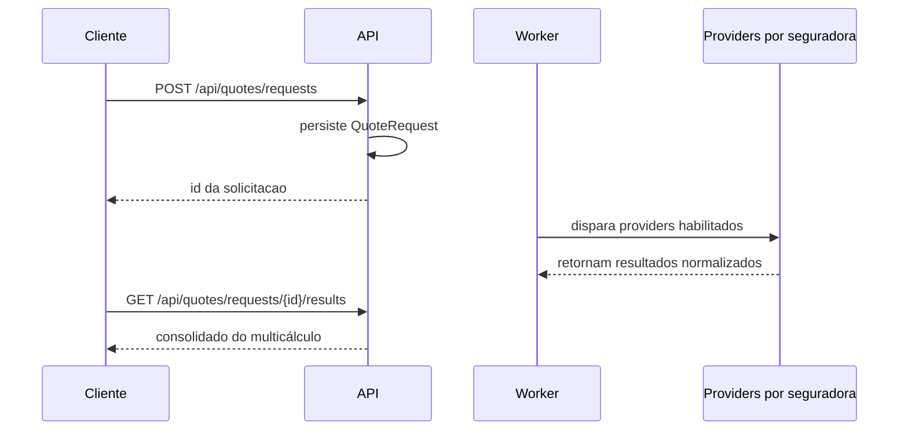
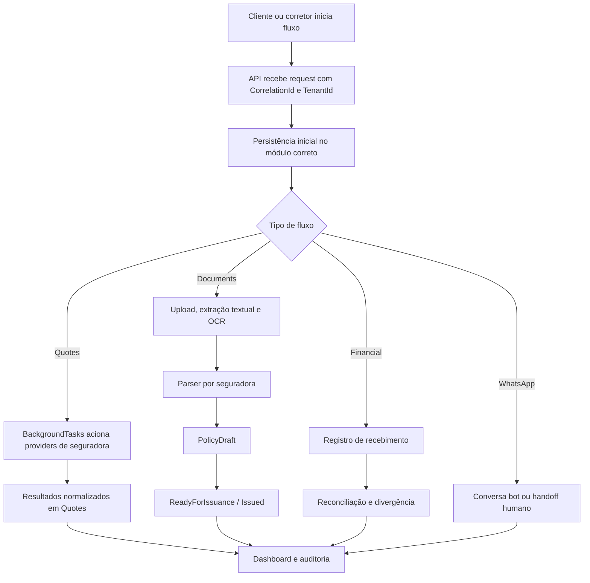

# W.Assis Insurance ERP

Plataforma e ERP digital da corretora W.Assis, construída como um monólito modular no estilo Equinox, com foco em `Clean Architecture`, `DDD`, `CQRS`, integração por seguradora e separação clara de responsabilidades entre domínio, aplicação, infraestrutura e host.

## Stack

- `.NET 8`
- `MediatR`
- `FluentValidation`
- `EF Core + PostgreSQL`
- `MassTransit + RabbitMQ`
- `Dapper`
- `Serilog + OpenTelemetry`
- `Redis`

## Estrutura da solução

- `WAssis.Domain.Core`
- `WAssis.Domain`
- `WAssis.Application`
- `WAssis.Infra.Data`
- `WAssis.Infra.CrossCutting.Bus`
- `WAssis.Infra.CrossCutting.Identity`
- `WAssis.Infra.CrossCutting.IoC`
- `WAssis.Services.Api`
- `WAssis.BackgroundTasks`
- `WAssis.UI.Web`
- `WAssis.Tests`

## Módulos do negócio

- `Identity`
- `Customers`
- `Billing`
- `Quotes`
- `Policies`
- `Claims`
- `Documents`
- `Financial`
- `Notifications`
- `WhatsAppSupport`

## O que já está implementado

- esqueleto funcional de `Quotes` com persistência, request idempotente por `CorrelationId` e processamento assíncrono
- provider real da `Justos` já integrado ao multicálculo
- catálogo operacional de providers em `GET /api/quotes/providers`
- providers de `Bradesco Seguros` e `Icatu Seguros` já modelados com readiness, requisitos e documentação oficial
- `Documents` com upload de PDF de proposta, extração textual e fallback de OCR configurável
- parser inicial de proposta com perfil por seguradora
- `Policies` com `PolicyDraft`, progressão até emissão interna e `PolicyNumber`
- `Financial` e `Documents` persistidos com `EF Core`
- `Billing` preparado para assinatura e fatura das corretoras clientes do ERP
- dashboard operacional e trilha de auditoria
- base de identidade com `JWT`, `claims`, `roles` e políticas
- base de isolamento multi-tenant com `TenantId` nos agregados centrais e filtro por tenant no `DbContext`

## Regra de organização das seguradoras

- cada seguradora deve ter um modulo proprio dentro de `src/WAssis.Infra.Data/Integrations/Modules/Quotes/Carriers`
- dentro de cada seguradora, os ramos devem ser separados apenas quando existirem APIs distintas por ramo
- nem toda seguradora precisa expor `Auto`, `Life`, `Residence` ou outros ramos
- a prioridade atual de evolucao para novas integracoes e `auto`

Exemplos:

- `Carriers/Justos/Auto` concentra a integracao real atualmente implementada
- `Carriers/Bradesco/Auto` representa o primeiro ramo documentado e preparado nessa seguradora
- `Carriers/Liberty` ja esta organizado por ramos porque o OpenAPI recebido indica APIs separadas
- seguradoras sem documentacao validada ainda nao devem ganhar submodulos artificiais so para manter simetria

## Como o multicálculo funciona

- a API recebe um único request canônico de cotação
- o sistema persiste esse request antes de chamar seguradoras
- o worker carrega os `IQuoteProvider` habilitados
- cada provider adapta o request comum para a API da sua seguradora e do seu ramo
- os resultados voltam normalizados para o mesmo `QuoteRequest`
- o cliente consulta o consolidado por `GET /api/quotes/requests/{id}/results`



Trade-offs desta decisão:

- `pro`: o domínio e os controllers continuam estáveis mesmo com novas seguradoras
- `pro`: a variação de autenticação, payload e resposta fica isolada nos adapters
- `pro`: facilita evoluir por seguradora e por ramo sem contaminar o fluxo público
- `contra`: os providers ficam mais complexos
- `contra`: o contrato canônico precisa ser bem cuidado para não ficar simplista demais
- `contra`: polling, timeout e filtro de providers ficam mais relevantes conforme o multicálculo cresce

## Endpoints já disponíveis

- `POST /api/billing/subscriptions`
- `GET /api/billing/subscriptions/{id}`
- `POST /api/billing/subscriptions/{id}/invoices`
- `GET /api/billing/invoices/{id}`
- `POST /api/billing/invoices/{id}/pay`
- `POST /api/quotes/requests`
- `GET /api/quotes/requests/{id}`
- `GET /api/quotes/requests/{id}/results`
- `GET /api/quotes/providers`
- `POST /api/documents/proposals/uploads`
- `GET /api/documents/proposals/{id}`
- `POST /api/documents/proposals/{id}/review`
- `POST /api/documents/proposals/{id}/reprocess`
- `POST /api/policies/drafts/from-document`
- `GET /api/policies/drafts/{id}`
- `POST /api/policies/drafts/{id}/approve-review`
- `POST /api/policies/drafts/{id}/ready`
- `POST /api/policies/drafts/{id}/issue`
- `POST /api/financial/statement-analyses`
- `GET /api/financial/reconciliations/{id}`
- `POST /api/financial/reconciliations/{id}/settle`
- `GET /api/operations/dashboard`
- `POST /api/identity/login`
- `GET /api/identity/me`
- `POST /api/whatsapp/conversations/inbound`
- `GET /api/whatsapp/conversations/queue`
- `GET /api/whatsapp/conversations/{id}`
- `POST /api/whatsapp/conversations/{id}/assign`
- `POST /api/whatsapp/conversations/{id}/close`

## Fluxograma macro



## Como rodar localmente

### Configuração para os frontends

Por padrão a API libera CORS para:

- `http://localhost:5173`
- `http://localhost:5174`
- `http://localhost:3000`

Essas origens ficam em `Frontend:AllowedOrigins` no `src/WAssis.Services.Api/appsettings.json` e podem ser sobrescritas por variável de ambiente:

```powershell
$env:Frontend__AllowedOrigins__0="http://localhost:5173"
$env:Frontend__AllowedOrigins__1="http://localhost:5174"
```

Nos frontends, configure:

```env
VITE_API_BASE_URL=https://localhost:54269
```

### API

```powershell
dotnet run --project src\WAssis.Services.Api\WAssis.Services.Api.csproj
```

### Worker

```powershell
dotnet run --project src\WAssis.BackgroundTasks\WAssis.BackgroundTasks.csproj
```

### Infra local com Docker

Melhor opção para agora: subir apenas a infraestrutura local via Docker e manter API/worker rodando por `dotnet run`.

```powershell
docker compose -f docker/docker-compose.yml up -d
```

Serviços locais:

- PostgreSQL em `localhost:5432`
- RabbitMQ em `localhost:5672`
- painel do RabbitMQ em `http://localhost:15672`
- Redis em `localhost:6379`

Mais detalhes em `docs/local-docker.md`.

### Build

```powershell
dotnet build WAssisInsurance.sln -p:UseSharedCompilation=false -nodeReuse:false
```

### Testes

```powershell
dotnet test WAssisInsurance.sln -p:UseSharedCompilation=false -nodeReuse:false
```

## CI

O repositório agora possui validação automática no GitHub Actions em PRs e pushes para `main`, usando o workflow `.github/workflows/pr-validation.yml`.

## Configuração

O projeto já possui seções de configuração para:

- `Frontend:AllowedOrigins`
- `Identity:Jwt`
- `Ocr`
- `Quotes:Providers:Justos:Auto`
- `Quotes:Providers:BradescoSeguros:Auto`
- `Quotes:Providers:IcatuSeguros`
- `Quotes:Providers:Liberty:Auto`
- `Quotes:Providers:Liberty:Life`
- `Quotes:Providers:Liberty:Residence`
- `Quotes:Providers:Liberty:Business`
- `Quotes:Providers:Liberty:Travel`

As integrações reais por seguradora dependem das credenciais e do detalhamento do produto ou jornada liberado por cada parceiro.
O modelo de dados também já começou a ser preparado para operação multi-tenant entre corretoras.

## Segurança operacional

- Nunca commitar chaves reais de seguradoras, certificados, JWT signing keys ou connection strings.
- Usar `dotnet user-secrets` ou variáveis de ambiente para segredos locais.
- `Identity:DevelopmentAuth` e credenciais de exemplo são apenas para desenvolvimento e ficam bloqueados fora de `Development`.
- Validar dependências antes de release:

```powershell
dotnet list WAssisInsurance.sln package --vulnerable --include-transitive
```

## Documentação de seguradoras com acesso hoje

- `Justos`: documentacao oficial acessivel e provider real de `auto` implementado
- `Bradesco Seguros`: documentacao publica oficial acessivel
- `Icatu Seguros`: portal oficial acessivel
- `Liberty / Yelum`: OpenAPI recebido e analisado

Sem documentacao validada no repositorio neste momento:

- `Allianz`
- `Porto`
- `Tokio`

## Documentação

Documentação técnica no repositório:

- `docs/architecture-overview.md`
- `docs/identity-access-model.md`
- `docs/billing-overview.md`
- `docs/quotes-provider-justos.md`
- `docs/quotes-provider-bradesco.md`
- `docs/quotes-provider-icatu.md`
- `docs/quotes-provider-liberty.md`
- `docs/financial-documents-flows.md`
- `docs/fluxos-mercado-mapeamento.md`
- `docs/local-docker.md`

Documentação executiva e de acompanhamento também está sendo mantida no Notion do projeto.

Bootstrap para o frontend:

- `docs/frontend-api-bootstrap.md`
- `docs/collections/WAssisInsurance.local.postman_collection.json`
- `docs/collections/WAssisInsurance.local.postman_environment.json`
