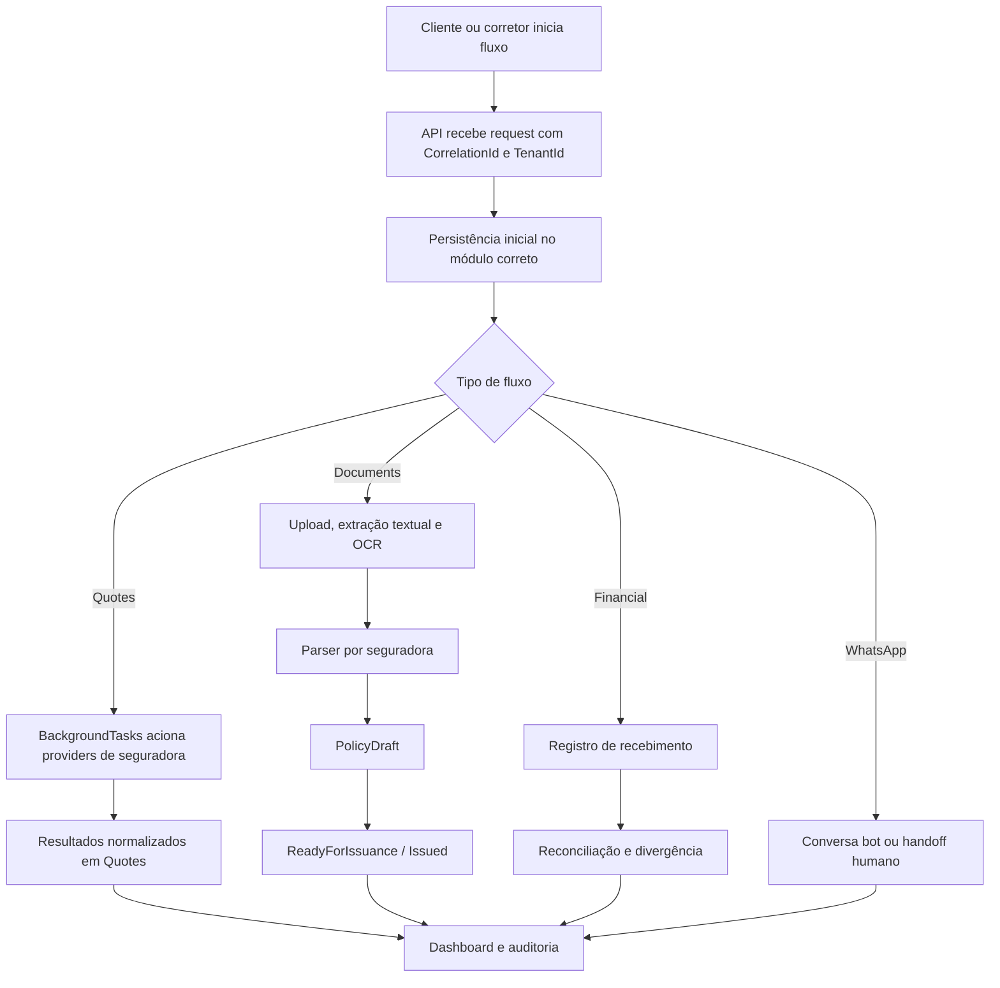

# W.Assis Insurance ERP

Plataforma e ERP digital da corretora W.Assis, construída como um monólito modular no estilo Equinox, com foco em `Clean Architecture`, `DDD`, `CQRS`, integração por seguradora e separação clara de responsabilidades entre domínio, aplicação, infraestrutura e host.

## Stack

- `.NET 8`
- `MediatR`
- `FluentValidation`
- `EF Core + PostgreSQL`
- `MassTransit + RabbitMQ`
- `Dapper`
- `Serilog + OpenTelemetry`
- `Redis`

## Estrutura da solução

- `WAssis.Domain.Core`
- `WAssis.Domain`
- `WAssis.Application`
- `WAssis.Infra.Data`
- `WAssis.Infra.CrossCutting.Bus`
- `WAssis.Infra.CrossCutting.Identity`
- `WAssis.Infra.CrossCutting.IoC`
- `WAssis.Services.Api`
- `WAssis.BackgroundTasks`
- `WAssis.UI.Web`
- `WAssis.Tests`

## Módulos do negócio

- `Identity`
- `Customers`
- `Quotes`
- `Policies`
- `Claims`
- `Documents`
- `Financial`
- `Notifications`
- `WhatsAppSupport`

## O que já está implementado

- esqueleto funcional de `Quotes` com persistência, request idempotente por `CorrelationId` e processamento assíncrono
- provider real da `Justos` já integrado ao multicálculo
- catálogo operacional de providers em `GET /api/quotes/providers`
- providers de `Bradesco Seguros` e `Icatu Seguros` já modelados com readiness, requisitos e documentação oficial
- `Documents` com upload de PDF de proposta, extração textual e fallback de OCR configurável
- parser inicial de proposta com perfil por seguradora
- `Policies` com `PolicyDraft`, progressão até emissão interna e `PolicyNumber`
- `Financial` e `Documents` persistidos com `EF Core`
- dashboard operacional e trilha de auditoria
- base de identidade com `JWT`, `claims`, `roles` e políticas
- base de isolamento multi-tenant com `TenantId` nos agregados centrais e filtro por tenant no `DbContext`

## Endpoints já disponíveis

- `POST /api/quotes/requests`
- `GET /api/quotes/requests/{id}`
- `GET /api/quotes/requests/{id}/results`
- `GET /api/quotes/providers`
- `POST /api/documents/proposals/uploads`
- `GET /api/documents/proposals/{id}`
- `POST /api/documents/proposals/{id}/review`
- `POST /api/documents/proposals/{id}/reprocess`
- `POST /api/policies/drafts/from-document`
- `GET /api/policies/drafts/{id}`
- `POST /api/policies/drafts/{id}/approve-review`
- `POST /api/policies/drafts/{id}/ready`
- `POST /api/policies/drafts/{id}/issue`
- `POST /api/financial/statement-analyses`
- `GET /api/financial/reconciliations/{id}`
- `POST /api/financial/reconciliations/{id}/settle`
- `GET /api/operations/dashboard`
- `GET /api/identity/me`
- `POST /api/whatsapp/conversations/inbound`
- `GET /api/whatsapp/conversations/queue`
- `GET /api/whatsapp/conversations/{id}`
- `POST /api/whatsapp/conversations/{id}/assign`
- `POST /api/whatsapp/conversations/{id}/close`

## Fluxograma macro



## Como rodar localmente

### API

```powershell
dotnet run --project src\WAssis.Services.Api\WAssis.Services.Api.csproj
```

### Worker

```powershell
dotnet run --project src\WAssis.BackgroundTasks\WAssis.BackgroundTasks.csproj
```

### Build

```powershell
dotnet build WAssisInsurance.sln -p:UseSharedCompilation=false -nodeReuse:false
```

### Testes

```powershell
dotnet test WAssisInsurance.sln -p:UseSharedCompilation=false -nodeReuse:false
```

## Configuração

O projeto já possui seções de configuração para:

- `Identity:Jwt`
- `Ocr`
- `Quotes:Providers:Justos`
- `Quotes:Providers:BradescoSeguros`
- `Quotes:Providers:IcatuSeguros`

As integrações reais por seguradora dependem das credenciais e do detalhamento do produto ou jornada liberado por cada parceiro.
O modelo de dados também já começou a ser preparado para operação multi-tenant entre corretoras.

## Documentação

Documentação técnica no repositório:

- `docs/architecture-overview.md`
- `docs/identity-access-model.md`
- `docs/quotes-provider-justos.md`
- `docs/quotes-provider-bradesco.md`
- `docs/quotes-provider-icatu.md`
- `docs/financial-documents-flows.md`
- `docs/fluxos-mercado-mapeamento.md`

Documentação executiva e de acompanhamento também está sendo mantida no Notion do projeto.
