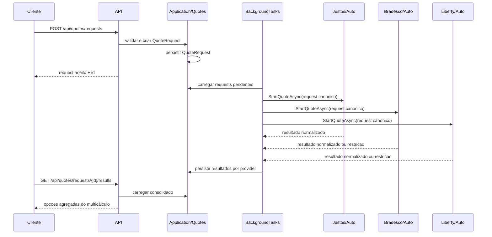

# Arquitetura do ERP W.Assis

## Stack base

- `.NET 8`
- `Clean Architecture + DDD + CQRS logico incremental`
- `EF Core + PostgreSQL`
- `MediatR + FluentValidation`
- `Serilog`

## Solucao

- `WAssis.Domain.Core`
- `WAssis.Domain`
- `WAssis.Application`
- `WAssis.Infra.Data`
- `WAssis.Infra.CrossCutting.Bus`
- `WAssis.Infra.CrossCutting.Identity`
- `WAssis.Infra.CrossCutting.IoC`
- `WAssis.Services.Api`
- `WAssis.BackgroundTasks`
- `WAssis.UI.Web`
- `WAssis.Tests`

## Principios operacionais

- `CorrelationId` em todos os fluxos relevantes
- idempotencia em escrita sensivel
- processamento assincrono com persistencia antes da integracao
- auditoria por modulo e acao
- sem logar PII em claro
- isolamento multi-tenant nos agregados centrais
- uma base PostgreSQL exclusiva por ambiente antes de escalar horizontalmente
- migrations executadas por tarefa singleton antes do rollout

## Escalabilidade e CQRS

A primeira fase de preparação para load balance e CQRS lógico está implementada. Ela inclui forwarded headers restritos às redes confiáveis, identificação de instância nos health checks, modo one-shot de migration, contratos explícitos de command/query, leituras sem tracking e transações opt-in para estado + auditoria.

O roadmap, os bloqueios de HML/PRD e os critérios para ativar duas réplicas estão em [`scalability-cqrs-roadmap.md`](scalability-cqrs-roadmap.md).

## Estado atual

### Backend ja implementado

- esqueleto funcional de `Quotes`
- primeiro provider real de `Quotes` baseado na API da `Justos`
- catalogo operacional de seguradoras em `GET /api/quotes/providers`
- fluxo de `Documents` com upload de proposta PDF
- extracao por camada textual com fallback de OCR configuravel via `Tesseract`
- parser de proposta com perfil por seguradora e fallback generico
- criacao de `PolicyDraft` a partir de documento parseado
- progressao de `PolicyDraft` ate `Issued`
- `Billing` separado de `Financial` para assinatura e faturamento das corretoras clientes do ERP
- `Financial` e `Documents` persistidos com EF
- visao operacional via `GET /api/operations/dashboard`
- trilha de auditoria em `operations.audit_entries`
- canal inicial de `WhatsAppSupport`
- base de identidade JWT com claims e roles
- isolamento por `TenantId` nos agregados principais, filtros globais no EF e migration dedicada

### Integracoes em espera por documentacao ou mapeamento detalhado

- ampliacao de providers alem da `Justos`
- integracoes documentais automaticas por seguradora
- emissao externa por seguradora

## Arquitetura alvo para seguradoras

- cada seguradora deve ter um modulo proprio dentro de `Quotes`
- dentro do modulo da seguradora, os ramos devem ser separados apenas quando a seguradora realmente tiver APIs distintas para eles
- nem toda seguradora precisa ter as mesmas subpastas ou os mesmos ramos
- o contrato canonico de `Quotes` deve continuar enxuto; a variacao de ramo fica encapsulada no modulo da seguradora
- a prioridade atual de integracao para novos provedores e `auto`

Exemplo de desenho esperado:

- `Carriers/SeguradoraX/Auto`
- `Carriers/SeguradoraX/Life`
- `Carriers/SeguradoraX/Residence`

Se a seguradora nao oferecer um ramo, a pasta correspondente nao deve existir.

## Fluxo de multicalculo

O fluxo planejado de multicálculo segue o modelo `um request canonico -> varios providers`.

1. a API recebe uma única solicitação em `POST /api/quotes/requests`
2. a aplicação valida e persiste um `QuoteRequest` canônico com `CorrelationId`
3. o request não depende de payload específico de seguradora no controller
4. o worker busca a solicitação pendente e carrega os `IQuoteProvider` registrados
5. cada provider avalia se está habilitado, pronto e se possui dados mínimos para aquele contexto
6. cada provider traduz o request canônico para o contrato externo da sua seguradora e ramo
7. os resultados retornam normalizados para o módulo de `Quotes`
8. a API expõe o consolidado por `GET /api/quotes/requests/{id}/results`

### Sequencia resumida

Em termos de responsabilidade:

- `Domain` e `Application` seguram o fluxo canônico, ids, status e persistência
- `Controllers` expõem endpoints estáveis e não conhecem payload de parceiro
- `Infra.Data/Integrations/.../Carriers` encapsula os adapters por seguradora e ramo
- `BackgroundTasks` orquestra o disparo assíncrono para vários providers

## Trade-offs da decisao tecnica

### Beneficios

- preserva um contrato público estável para `Quotes`, mesmo quando entram novas seguradoras
- reduz acoplamento do domínio a APIs externas que mudam com frequência
- permite evoluir um ramo de uma seguradora sem contaminar outras integrações
- facilita operar multicálculo como agregação de providers, e não como explosão de controllers
- melhora observabilidade e readiness por seguradora via `GET /api/quotes/providers`

### Custos e limites

- o contrato canônico precisa ser bem desenhado para não ficar genérico demais
- parte do mapeamento fica concentrada nos adapters, o que aumenta trabalho de integração
- seguradoras com fluxos assíncronos podem exigir polling e estados intermediários extras
- filtrar quais providers devem participar de cada cotação fica mais importante conforme a malha cresce
- existe risco de duplicar regras operacionais em vários providers se faltarem abstrações comuns

### Porque a variacao nao sobe para Domain ou Controllers

- a estrutura por seguradora e ramo representa detalhe de integração, não regra central do negócio
- colocar `Justos/Auto`, `Liberty/Life` ou similares no domínio acoplaria o core a contratos externos
- colocar isso nos controllers quebraria a ideia de entrada única para multicálculo
- a variação fica melhor encapsulada nos providers porque é ali que vivem autenticação, payload e parsing específicos

## Documentacao acessivel hoje

- `Justos`: documentacao oficial acessivel e integracao real de `auto` ja implementada
- `Bradesco Seguros`: portal oficial e documentacao tecnica de credenciais acessiveis
- `Icatu Seguros`: portal oficial de APIs acessivel
- `Liberty / Yelum`: especificacao OpenAPI recebida localmente e convertida em modulo tecnico inicial

Ainda sem documentacao validada no repositorio:

- `Allianz`
- `Porto`
- `Tokio`

## Endpoints canonicos ja disponiveis

- `POST /api/quotes/requests`
- `POST /api/billing/subscriptions`
- `GET /api/billing/subscriptions/{id}`
- `POST /api/billing/subscriptions/{id}/invoices`
- `GET /api/billing/invoices/{id}`
- `POST /api/billing/invoices/{id}/pay`
- `GET /api/quotes/requests/{id}`
- `GET /api/quotes/requests/{id}/results`
- `GET /api/quotes/providers`
- `POST /api/documents/proposals/uploads`
- `GET /api/documents/proposals/{id}`
- `POST /api/policies/drafts/from-document`
- `GET /api/policies/drafts/{id}`
- `POST /api/policies/drafts/{id}/ready`
- `POST /api/policies/drafts/{id}/issue`
- `GET /api/operations/dashboard`
- `POST /api/whatsapp/conversations/inbound`
- `GET /api/whatsapp/conversations/{id}`

## Observabilidade do multicalculo

- `GET /api/quotes/providers` expoe o estado operacional dos providers de cotacao
- cada provider informa:
  - se esta habilitado
  - se esta pronto de fato
  - modo de autenticacao esperado
  - documentacao oficial
  - requisitos faltantes de configuracao

Isso da visibilidade para backend, frontend e operacao sem depender de leitura manual de `appsettings`.
